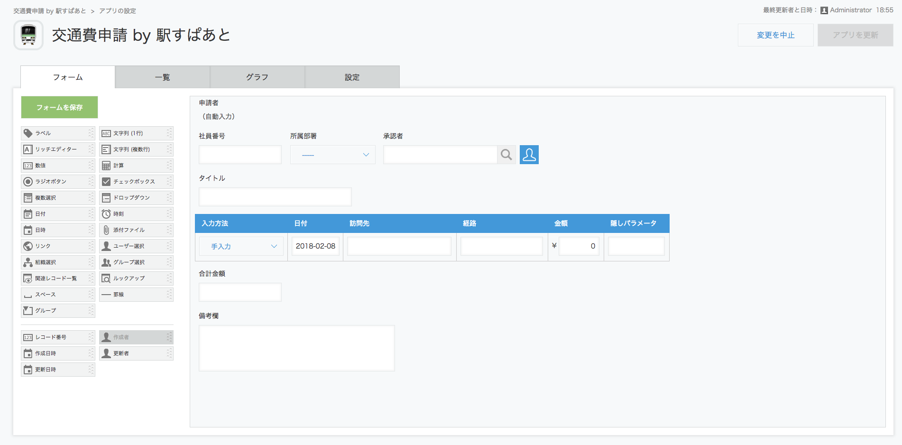
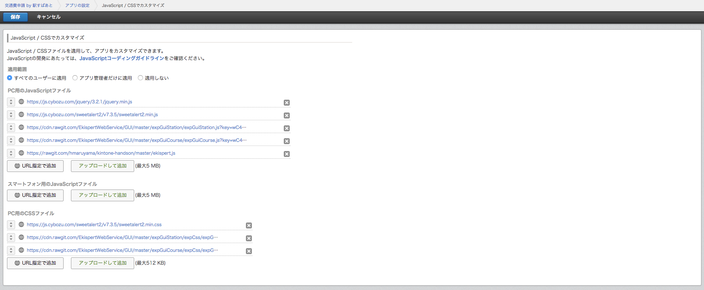

# 交通費申請 by 駅すぱあと (kintoneアプリ)

# 概要

kintone内で、駅すぱあとを利用した交通費申請を行うアプリです。
Javascriptを利用してアプリをカスタマイズしています。

### 利用サービス

* kintone
* 駅すぱあとwebサービス
* jquery 3.2.1
* sweetalert 7.3.5

# 導入方法

## 1. 駅すぱあとwebサービスの申し込み

kintoneで駅すぱあとを利用した経路探索を行うには、「駅すぱあとwebサービス」という、経路探索WebAPIの利用申請を行う必要があります。

https://ekiworld.net/trial/index.php?case=6

## 2. kintoneアプリの作成

kintone内に、新しくアプリを作成します。

### フォーム

#### サブテーブル
|フィールド名|フィールドタイプ|フィールドコード|設定内容|
|---|---|---|---|
|入力方法|ドロップダウン|入力方法|項目は「手入力」と「駅すぱあと」にします。デフォルト値は「手入力」です。|
|日付|日付|日付||
|訪問先|文字列（1行）|訪問先||
|経路|文字列（1行）|経路||
|金額|数値|金額||
|隠しパラメータ|文字列（1行）|隠しパラメータ||

#### 合計金額

|フィールド名|フィールドタイプ|フィールドコード|設定内容|
|---|---|---|---|
|フィールド名|計算|計算|計算式は `SUM(金額)` とします。|

### Javascript / CSSのインポート

#### Javascript

* https://js.cybozu.com/jquery/3.2.1/jquery.min.js
* https://js.cybozu.com/sweetalert2/v7.3.5/sweetalert2.min.js
* https://cdn.rawgit.com/EkispertWebService/GUI/ed686b9d12d/expGuiStation/expGuiStation.js?key=駅すぱあとwebサービスのアクセスキー
* https://cdn.rawgit.com/EkispertWebService/GUI/ed686b9d12d/expGuiCourse/expGuiCourse.js?key=駅すぱあとwebサービスのアクセスキー
* https://cdn.rawgit.com/hmaruyama/kintone-handson/master/ekispert.js

#### CSS

* https://js.cybozu.com/sweetalert2/v7.3.5/sweetalert2.min.css
* https://cdn.rawgit.com/EkispertWebService/GUI/ed686b9d12d/expGuiStation/expCss/expGuiStation.css
* https://cdn.rawgit.com/EkispertWebService/GUI/ed686b9d12d/expGuiCourse/expCss/expGuiCourse.css
